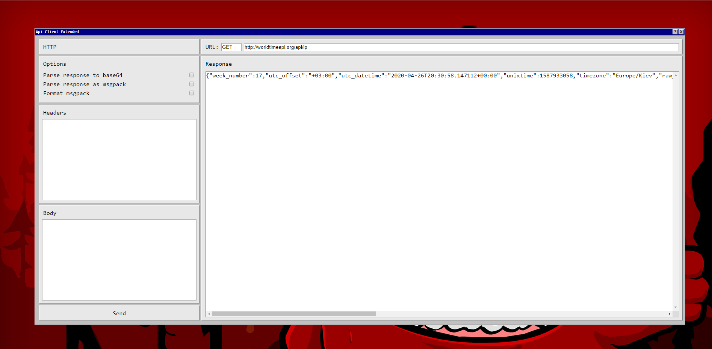

# Api Client: Extended

Application designed for testing api with specific results.

Available options:
  - "**Parse response to base64**" option handles any result and convert to Base64
  - "**Parse response as msgpack**" option handles binary and convert from MsgPack to JSON.
  - "**Format json**" option formats response json


[](https://travis-ci.org/joemccann/dillinger)

## Instalation

Install and run
```
$ npm install
$ npm run server
```

## Notes
Headers must be separated with semicolon ";"
```
header: value;
header2: value;
```

## Used solutions
| Plugin | Link |
| ------ | ------ |
| msgpack-javascript | https://github.com/msgpack/msgpack-javascript |
| js-beautify | https://github.com/beautify-web/js-beautify |